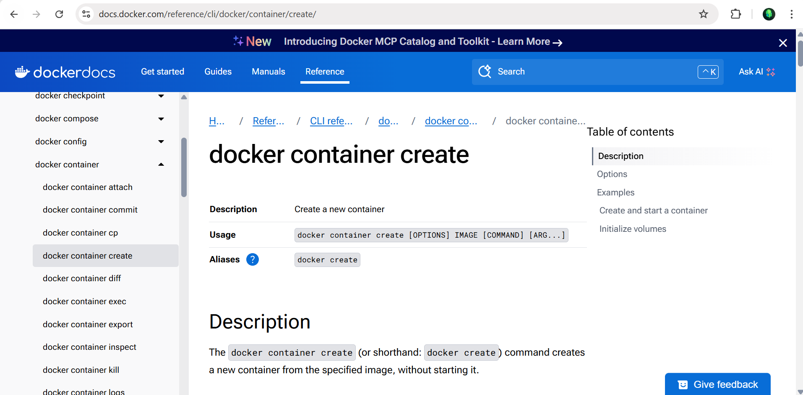
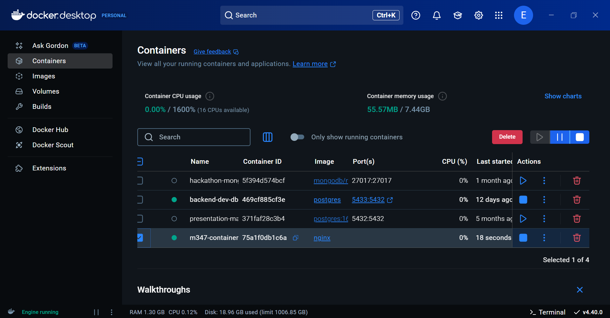

# KN01 Docker Grundlagen

## A. Installation

### Screenshot of the website


### Screenshot of the container in Docker Desktop  
Using these commands I created the container:
``docker pull nginx, docker container create --name m347-container nginx, docker container start m347-container`` 


## B. Docker CLI
Docker CLI documented commands
```
1. check version: docker --version
output: Docker version 28.0.4, build b8034c0
2. search docker: docker search nginx
output: List of name, description, stars and if its official or not
3. docker run explanation: docker run -d -p 80:80 docker/m347-container

```
